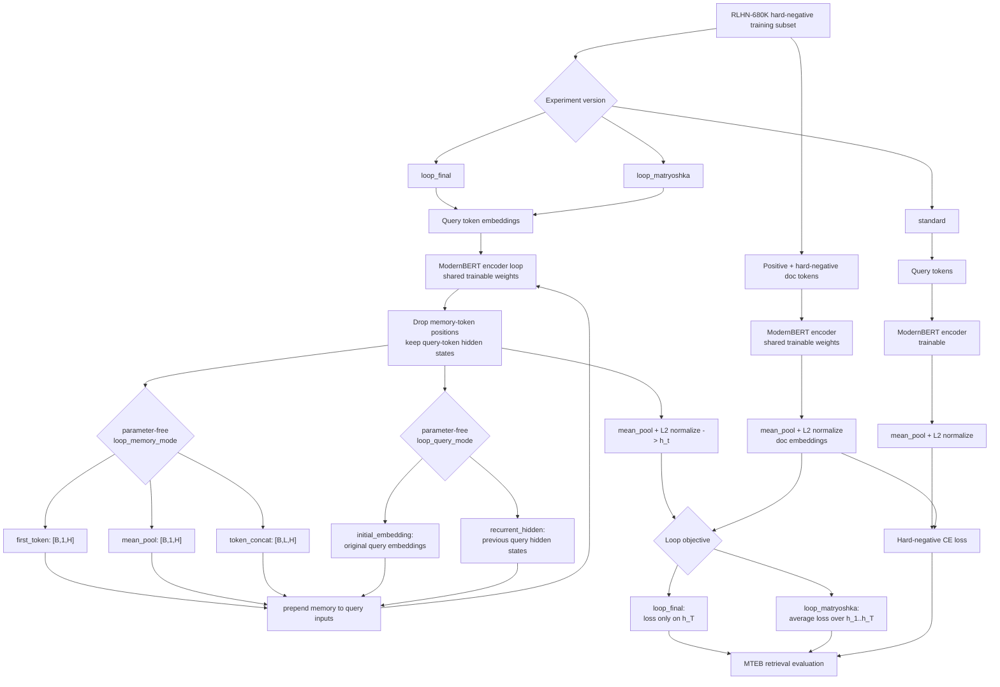

# Loop-Wise Matryoshka Retrieval

This repository contains a retrieval ablation suite for testing whether repeated query-side loops improve dense retrieval beyond a standard single-pass retriever.

The current experimental pipeline is:

```text
ModernBERT-base
-> RLHN-680K hard-negative training subset
-> MTEB retrieval evaluation, with SciFact as the default task
```

The project intentionally does not use online tuning, exit gates, adaptive stopping, dimension slicing, pseudo labels, in-batch negatives, trainable projection heads, or trainable memory adapters. All reported variants update only the ModernBERT encoder parameters and use normalized dot product similarity, equivalent to cosine similarity, with hard-negative cross entropy and `tau = 0.05`.

## Core Idea

The loop models keep the embedding dimension fixed and use query loop depth as the budget axis:

```text
x_1 = Emb(query tokens)

for t = 1..Tmax:
    y_t = ModernBERT(x_t)
    h_t = normalize(mean_pool(query-token positions in y_t))
    m_t = memory(y_t)
    q_{t+1} = query_update(y_t, Emb(query tokens))
    x_{t+1} = [m_t, q_{t+1}]
```



Pooling excludes memory tokens. Documents are encoded once and do not loop:

```text
doc_embedding = normalize(mean_pool(ModernBERT(doc tokens)))
```

The loop memory construction is parameter-free and selected by `loop_memory_mode`:

| Mode | Memory tensor passed to the next loop |
| --- | --- |
| `first_token` | First query-token hidden state, shape `[B, 1, H]`. |
| `mean_pool` | Mean-pooled query-token hidden state, shape `[B, 1, H]`. This is the default. |
| `none` | No memory token is prepended; the next loop receives only the selected query-token inputs. |
| `token_concat` | All query-token hidden states, shape `[B, L, H]`; the next loop input has shape `[B, 2L, H]`. |

The query-token inputs passed to the next loop are selected by `loop_query_mode`:

| Mode | Query-token inputs passed to the next loop |
| --- | --- |
| `initial_embedding` | Reuse the original query token embeddings at every loop. This is the default used by the original loop variants. |
| `recurrent_hidden` | Reuse the previous loop's query-token hidden states, so the next loop refines the token-level query state. |

Every query state and document embedding is full-dimensional and L2-normalized. With ModernBERT-base, `H = 768`.

## Experiment Versions

Experiment versions are registered in [src/experiments.py](src/experiments.py). Add new ablations there first so training, evaluation, and plotting stay consistent.

| Version | Family | What It Tests |
| --- | --- | --- |
| `standard` | baseline | Single-pass no-loop retriever; only ModernBERT encoder parameters are trainable. |
| `loop_final` | loop curve | Parameter-free memory loop retriever supervised only at the final loop. |
| `loop_matryoshka` | loop curve | Parameter-free memory loop retriever supervised at every loop. |
| `loop_final_recurrent_mean_pool` | loop curve | Mean-pool memory with recurrent query-token hidden states; supervised only at the final loop. |
| `loop_matryoshka_recurrent_mean_pool` | loop curve | Mean-pool memory with recurrent query-token hidden states; supervised at every loop. |
| `loop_final_recurrent_no_memory` | loop curve | No-memory recurrent query-token hidden states; supervised only at the final loop. |
| `loop_matryoshka_recurrent_no_memory` | loop curve | No-memory recurrent query-token hidden states; supervised at every loop. |

## Repository Layout

```text
configs/                  YAML configs for smoke and pre-experiment runs
docs/                     Notes for adding future ablations
scripts/                  Local and Slurm experiment entry points
src/                      Training, model, evaluation, plotting, and registry code
requirements.txt          Python dependencies
```

Generated artifacts are intentionally ignored by git:

```text
outputs/                  checkpoints, MTEB results, plots, summaries
.hf_cache/                Hugging Face datasets/models cache
slurm_logs/               cluster stdout/stderr logs
```

## Goal Acceptance Tracks

The autonomous goal protocol separates score reports into `standalone_main`, `fusion_diagnostic`, and `diagnostic` tracks. Any run that uses frozen-standard embeddings, scores, weighted standard+candidate concatenation, `fusion_standard_checkpoint_dir`, `fusion_alpha`, `fusion_scope`, or another explicit ensemble with the frozen standard model is `fusion_diagnostic`.

Fusion diagnostics may be evaluated and reported, but they cannot trigger main goal success. Main success requires a `standalone_main` final candidate with all seven protocol tasks valid, every `ndcg_at_10` delta at least `+0.002`, macro mean delta at least `+0.005`, and no task regression. The old `+0.001` all-task threshold is only `minimal_positive_signal`.

## Installation

```bash
conda create -n loopmat python=3.10 -y
conda activate loopmat
pip install -r requirements.txt
```

For Slurm runs, keep site-specific scheduler and environment choices outside the repository:

```bash
export CONDA_ENV=loopmat
export SBATCH_ARGS="--partition=<partition> --account=<account>"
bash scripts/slurm_run_preexp.sh
```

If `CONDA_ENV` is unset, batch scripts use `PYTHON_BIN` or the default `python` already available in the job shell.
Generated caches default to relative ignored directories such as `.hf_cache/` and `.mplconfig/`.

## Quick Smoke Test

From this directory:

```bash
bash scripts/run_smoke.sh
```

This trains the registered main variants on the smoke config and evaluates the configured MTEB retrieval tasks. The Python orchestrator exposes the same workflow:

```bash
python -m src.run_all --config configs/smoke.yaml --stage all
```

## Main Pre-Experiment

Local:

```bash
bash scripts/run_preexp.sh
```

Slurm:

```bash
bash scripts/slurm_run_preexp.sh
```

The pre-experiment config uses `train_sample_size = 50000`, `Tmax = 10`, and `num_negatives = 7`.

## Loop Memory Modes

The final experiment config uses `loop_memory_mode: mean_pool`. To run the same three registered versions with another parameter-free memory construction, override the config:

```bash
python -m src.run_all --config configs/smoke.yaml --stage train
python -m src.train --config configs/preexp.yaml --version loop_final --loop_memory_mode first_token
python -m src.train --config configs/preexp.yaml --version loop_matryoshka --loop_memory_mode token_concat
```

The generic version names stay fixed. `loop_memory_mode` changes only how the previous loop's query hidden states are converted into memory tokens for the next loop. `loop_query_mode` changes whether the next loop receives the original query token embeddings or the previous loop's query-token hidden states.

The recurrent mean-pool variants are registered as explicit versions so their behavior is reproducible without extra CLI overrides:

```bash
python -m src.train --config configs/preexp.yaml --version loop_final_recurrent_mean_pool
python -m src.train --config configs/preexp.yaml --version loop_matryoshka_recurrent_mean_pool
```

The recurrent no-memory variants remove the prepended memory token entirely and pass only the previous loop's query-token hidden states to the next loop:

```bash
python -m src.train --config configs/preexp.yaml --version loop_final_recurrent_no_memory
python -m src.train --config configs/preexp.yaml --version loop_matryoshka_recurrent_no_memory
```

## Evaluation And Plots

Evaluation is parameter-free inference on MTEB retrieval tasks. The default config evaluates `SciFact`, and the evaluation code also supports multiple retrieval tasks in one run. It writes raw MTEB JSON, parsed metrics, and summary rows. The primary metrics are:

- `nDCG@10`
- `Recall@10`
- `Recall@100`
- `MRR@10`
- `MAP@10`

To replot from a combined summary:

```bash
python -m src.plot_results \
  --summary_csv outputs/plots/results_summary_all.csv \
  --output_dir outputs/plots
```

Plotting is implemented with the Python standard library plus Matplotlib; it does not depend on pandas.

### Multiple Evaluation Tasks

Use `task_name` for the legacy single-task config and `task_names` for the multi-task config:

```yaml
task_name: SciFact
task_names:
  - SciFact
  - NFCorpus
  - SCIDOCS
  - FiQA2018
  - ArguAna
  - Touche2020
  - TRECCOVID
```

Direct CLI evaluation accepts either repeated task names or a comma-separated list:

```bash
python -m src.eval_mteb \
  --checkpoint_dir outputs/preexp/standard/final \
  --version standard \
  --task_names SciFact,NFCorpus,SCIDOCS \
  --eval_all_loops false \
  --output_dir outputs/preexp_eval
```

Local wrappers default to `SciFact`. They can run one task:

```bash
TASK_NAME=NFCorpus bash scripts/run_eval_all.sh
```

or several tasks:

```bash
TASK_NAMES="SciFact,NFCorpus,SCIDOCS,FiQA2018,ArguAna,Touche2020,TRECCOVID" \
  bash scripts/run_eval_all.sh
```

Slurm wrappers default to the full recommended retrieval-task set:

```text
SciFact,NFCorpus,SCIDOCS,FiQA2018,ArguAna,Touche2020,TRECCOVID
```

They support the same environment variables for overrides:

```bash
TASK_NAME=NFCorpus bash scripts/slurm_run_eval_all.sh

TASK_NAMES="SciFact,NFCorpus,SCIDOCS" \
  bash scripts/slurm_run_eval_all.sh
```

`TASK_NAMES` takes precedence over `TASK_NAME`. For Slurm, `DEFAULT_EVAL_TASKS` can also override the default full list without changing repository files.

## Output Convention

Smoke and pre-experiment runs use one directory per method under the run group:

```text
outputs/preexp/<method>/
  final/                 final checkpoint
  train_log.jsonl

outputs/preexp_eval/
  <method>/              Slurm per-method summaries, when submitted per method
  <version>/<task>/      raw and parsed MTEB outputs for local aggregate runs
  results_summary.csv

outputs/plots/
  results_summary_all.csv
  loop_depth_vs_*.png
  best_loop_summary.json
```

When a summary contains one task, plots are written directly under the requested plot directory. When a summary contains multiple tasks, the combined CSVs stay at the plot root and each task gets its own plot subdirectory, for example:

```text
outputs/preexp_eval/plots/
  results_summary_all.csv
  loop_depth_metrics.csv
  SciFact/
    loop_depth_vs_ndcg10.png
    best_loop_summary.json
  NFCorpus/
    loop_depth_vs_ndcg10.png
    best_loop_summary.json
```

`outputs/` is ignored by git because checkpoints are large. Keep reproducible code/configs in the repository and archive generated artifacts separately.

## Adding New Ablations

See [docs/ADDING_ABLATIONS.md](docs/ADDING_ABLATIONS.md).

The short version:

1. Add a `VersionSpec` in [src/experiments.py](src/experiments.py).
2. Reuse the existing `standard` or `loop` family when possible.
3. Add a small script under `scripts/` only for orchestration.
4. Finalize generated outputs with `python -m src.finalize_ablation`.
5. Replot with `python -m src.plot_results`.
